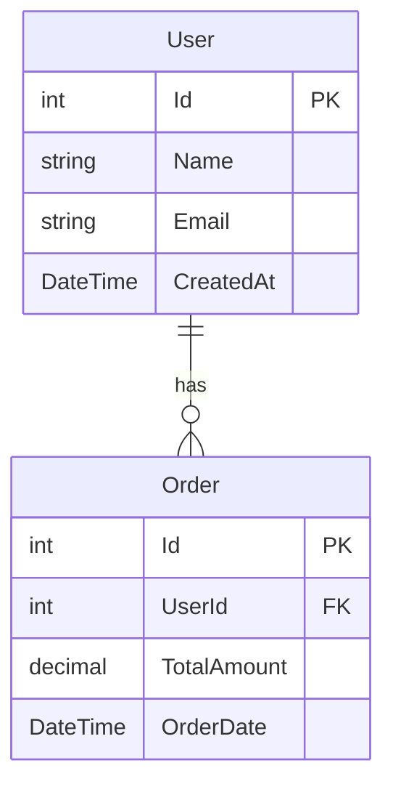
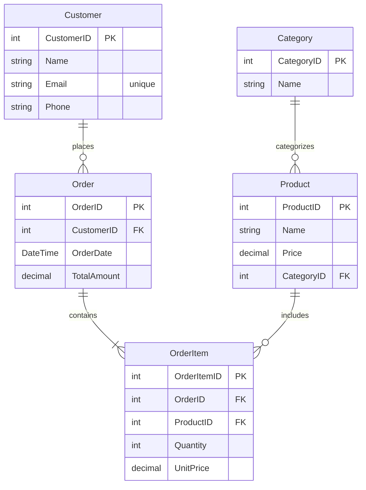

# 🛠️ EF Core ModelSnapshot 转 Mermaid 图工具


Aymadoka.EfCoreMermaid 是一个将 Entity Framework Core (EF Core) 模型快照转换为 Mermaid 图的工具，帮助开发者通过直观的可视化方式理解项目或数据库结构设计

# 🌟 特性
- 自动解析 EF Core 模型快照生成 Mermaid 实体关系图
- 支持显示实体、属性、主键、外键及关系
- 控制台界面快速预览

## 🚀 安装

通过 NuGet 包管理器安装：
```bash
Install-Package Aymadoka.EfCoreMermaid
```
或使用 .NET CLI：

```bash
dotnet add package Aymadoka.EfCoreMermaid
```

## 📖 使用方法
在代码中调用生成器：
1. 安装全局工具：
```csharp
using Aymadoka.EfCoreMermaid.Generators;
using Aymadoka.EfCoreMermaid.Snapshots;

// 生成 Mermaid 代码
var generator = new EfCoreMermaidGenerator<YourDbContextSnapshot>();
var mermaidCode = generator.GenerateErDiagram();

// 输出到文件或控制台
File.WriteAllText("database-diagram.mmd", mermaidCode);
```

## 📊 示例输出
### 简单实体关系图


### 复杂关系示例


## 🧩 开源贡献
本项目遵循 MIT 开源协议，欢迎共建：
* ⭐️ 在 GitHub 上给项目点个 Star
* 📝 提交 Issues 反馈问题或需求
* 🚀 提交 Pull Request 贡献代码
* 📢 分享给更多使用 EF Core 的开发者

GitHub 地址：[前往 GitHub](https://github.com/Aymadoka/Aymadoka.EfCoreMermaid)

## 📬 联系方式

如有问题或建议，请在 GitHub 上提交 Issue 或联系我：

📧 Email: aymadoka@foxmail.com
