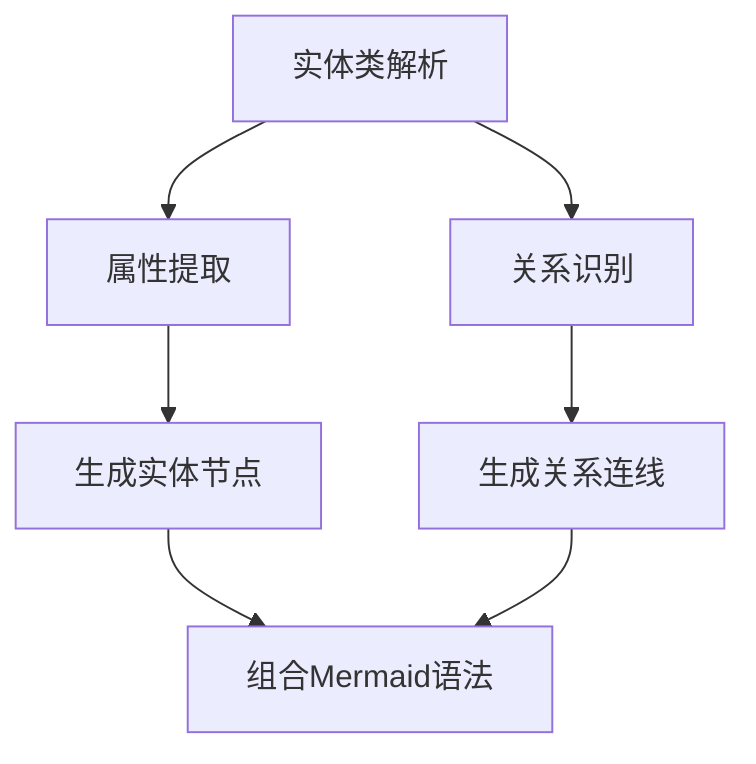

# 🛠️ EF Core ModelSnapshot 转 Mermaid ER 图工具

> 基于 Roslyn API 解析 EF Core ModelSnapshot 文件，自动生成 Mermaid 格式的 ER 图，助力数据库设计可视化。

## 🌟 项目简介

[Aymadoka.EfCoreMermaid](https://github.com/Aymadoka/Aymadoka.EfCoreMermaid) 是一个专注于 EF Core 项目的工具库，通过解析 Migrations 中的 ModelSnapshot 文件，利用 Roslyn 语法分析技术提取数据模型结构，最终生成可直接渲染的 Mermaid ER 图文本。

无论是团队协作中的数据模型沟通，还是重构时的模型梳理，该工具都能帮助开发者快速将代码中的数据模型转化为可视化图表，提升开发效率与项目可维护性。

## 🚀 核心功能

### 🔍 ModelSnapshot 解析
* 自动定位项目中的 ModelSnapshot.cs 文件
* 基于 Roslyn API 构建语法树，精准提取实体类定义
* 识别导航属性、主键、外键等关系映射

### 📊 Mermaid 生成
* 支持生成标准 Mermaid ER 图语法（mermaid graph格式）
* 自动映射实体关系（一对一、一对多、多对多）
* 包含属性类型、主键标识等详细元数据

### ⚙️ 灵活扩展
* 支持自定义命名空间过滤
* 可配置输出格式（缩进、关系线样式等）
* 预留钩子函数支持自定义实体转换逻辑

## 🛠️ 技术实现原理
### 🔗 Roslyn 语法分析流程
1. 通过 SyntaxFactory 加载 ModelSnapshot.cs 文本
2. 构建 SyntaxTree 并分析 ClassDeclarationSyntax
3. 提取 PropertyDeclarationSyntax 中的属性定义
4. 通过 IdentifierNameSyntax 解析导航属性关系

### 📉 Mermaid 生成逻辑

<!-- 


## 📦 安装与使用

### 🚀 安装方式
使用 NuGet 包管理器安装：
```bash
Install-Package Aymadoka.EfCoreMermaid
```

### 📝 使用示例
```csharp
using EF.Mermaid.Generator;
using Microsoft.CodeAnalysis;

// 示例：从ModelSnapshot文件生成Mermaid ER图
string snapshotPath = "YourProject/Migrations/ModelSnapshot.cs";
string projectDir = "YourProject/";

// 1. 创建生成器实例
var generator = new MermaidGenerator();

// 2. 配置项目编译环境（可选，用于解析依赖类型）
var compilationOptions = new CompilationOptions(OutputKind.DynamicallyLinkedLibrary);
generator.ConfigureProjectEnvironment(projectDir, compilationOptions);

// 3. 生成Mermaid代码
string mermaidCode = generator.GenerateFromSnapshot(snapshotPath);

// 4. 输出结果（可直接用于Markdown或Mermaid渲染工具）
Console.WriteLine(mermaidCode);
```

-->

## 🧩 开源贡献
本项目遵循 MIT 开源协议，欢迎共建：
* ⭐️ 在 GitHub 上给项目点个 Star
* 📝 提交 Issues 反馈问题或需求
* 🚀 提交 Pull Request 贡献代码
* 📢 分享给更多使用 EF Core 的开发者

GitHub 地址：[前往 GitHub](https://github.com/Aymadoka/Aymadoka.EfCoreMermaid)

## 📬 联系方式

如有问题或建议，请在 GitHub 上提交 Issue 或联系我：

📧 Email: aymadoka@foxmail.com


